# Getting Started

## Setting up bridge.

In order to start using bridge., you must first open it. bridge. v2 is a PWA meaning it can be used in a supported browser and/or installed to your system. To access bridge. v2 head to https://editor.bridge-core.app.

To install bridge.:

-   Click the **Install App** prompt in the sidebar, which you will be able to click after creating your first project.
-   Click the install button on the right of the URL bar.
-   Choose to install the app in the first setup step.

The first time you open bridge., you will be met with a setup screen, where you must follow 4 simple steps.

1. Install bridge. for a better experience and the ability to use bridge. offline!

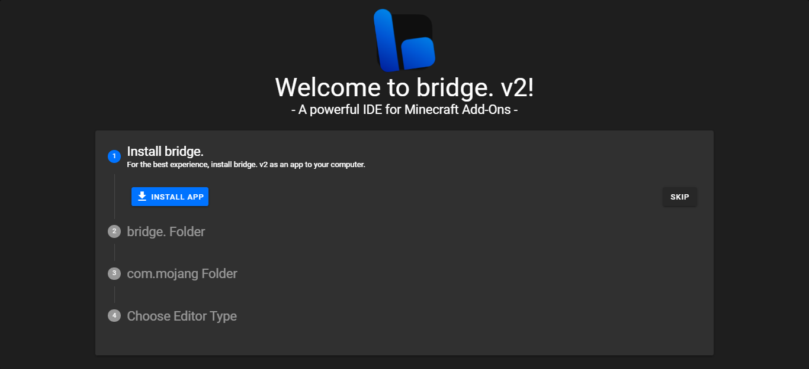

2. Select the folder where bridge. should store its projects. This should not be your `com.mojang` folder or any folders that contain system files. Make sure to give permissions in the prompt that will pop up.

1. Link your `com.mojang` folder to bridge., by dragging it from the Minecraft directory (`C:\Users\<USER>\AppData\Local\Packages\Microsoft.MinecraftUWP_8wekyb3d8bbwe\LocalState\games\com.mojang`). This step is optional and can be skipped, however doing so will mean your projects will not automatically be compiled to your Minecraft development packs folders. Make sure to give permissions in the prompt that will pop up.

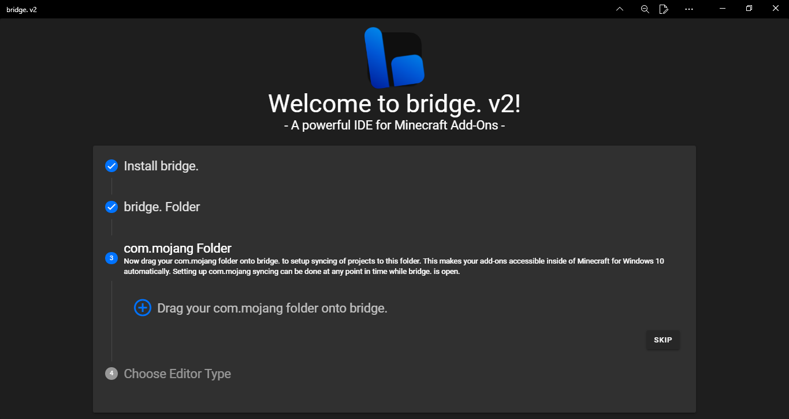

4. Choose your editor type. You can choose to use the [Tree Editor](#Tree-Editor) or the [Code Editor](#Code-Editor).

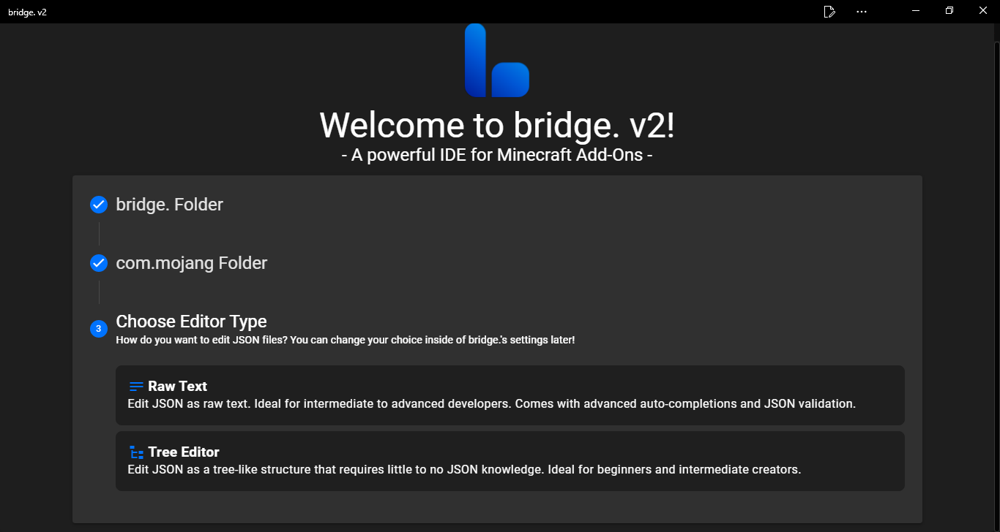

## Creating a project

To get started making addons with bridge. you need to create a project.

With bridge., creating a new project is easy.
If this is your first project and you have just set up bridge., the project creation window will automatically appear. Otherwise, to open the project creation window, click the **New Project** button in the Quick Actions menu on the welcome screen, or click the first button on the sidebar to open the **Projects** window and click **New Project** in the top right of the window.

Here you can customize your pack to your liking. You can modify the:

-   Pack types your project should contain.
-   Which experimental gameplay toggles you want your project to use.
-   Individual files to be created in your packs upon project creation.
-   Name and description of your project.
-   Author of your projects.
-   Pack icon of your project.
-   Target Minecraft version of your project.
-   Project namespace. **The prefix of identifiers used in your pack, e.g `minecraft` in `minecraft:apple`**

There are also toggles to enable/disable things like registering the RP as a BP dependency.

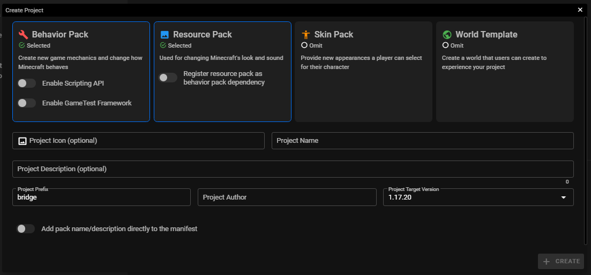

Once you've done that, you can click **Create!** and bridge. will set up all of the neccessary project files.

## Creating files

bridge. supports creating **all** files that Minecraft supports.
You can create a file in your Behavior Pack, Resource pack, Skin pack or World template by clicking the new file button, or pressing `ctrl + n`.

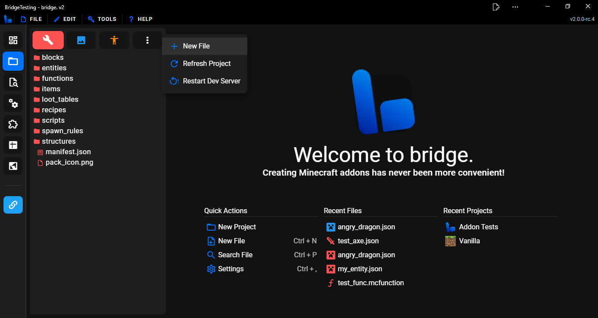

Doing this will open the new file window. Here you will see a sidebar in the window which lets you select from all of the possible files you can create.

_Remember you can scroll down the sidebar or search to see more file types you can create!_

bridge.'s preset window contains multiple categories:

-   Block - Templates for different types of blocks.
-   Entity - Templates for different types of entites.
-   Item - Templates for different types of items.
-   Simple Files - Allows you to create individual files.
-   Skins - Allows you to add skins to the skin pack.

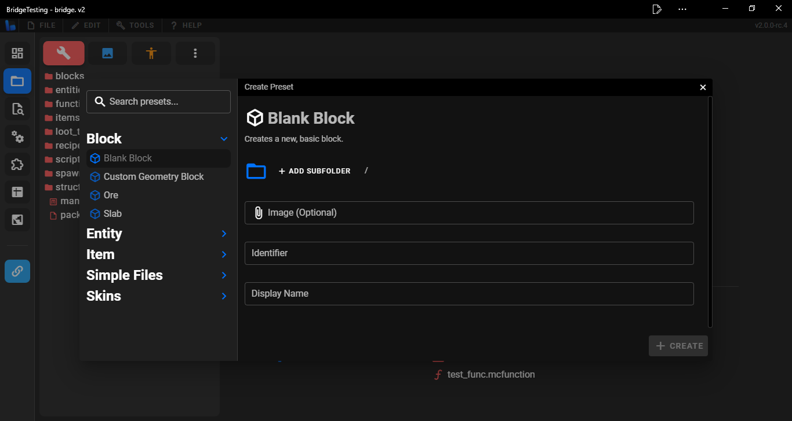

Once you have selected a file, you will see that you need to input an identifier/file name and possibly other inputs depending on the type of file you are trying to create.

Once you have done that, click **Create!** and the preset will be created and all created files will be opened.

## Editing files

Files can be editied by opening them in the Pack Explorer sidebar. Additionally, you can drag a file onto bridge. which will then give you the option to edit the file or add it to your project.

### JSON

When you open a JSON file with bridge., it will open in either a code view editor or a tree view editor. Both include colorful syntax highlighting, auto-completions, "Go To Definition" and more!

#### Code Editor

The code view editor is a more traditional way of editing, giving you access to typing whatever you want in the file. It is a similar editing experience to VSCode but with all of the other amazing tools and features that bridge. has to offer.

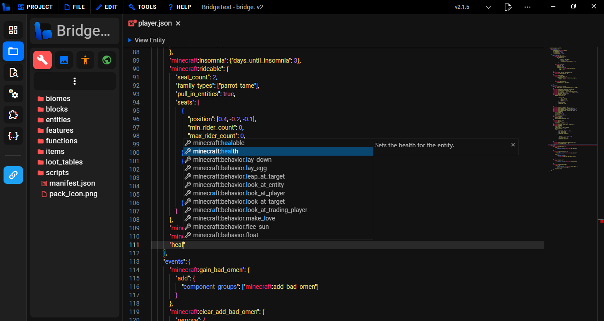

#### Tree Editor

Similar to the editor featured in bridge. v1, the tree editor is recommended for users that have little knowledge of JSON because you can't make syntax errors.

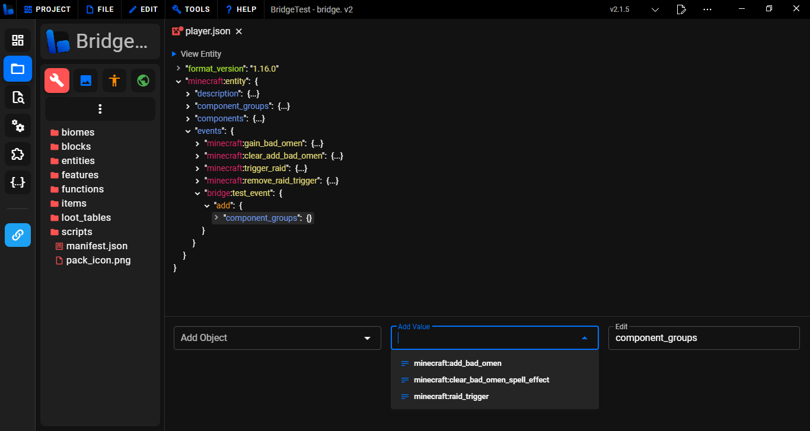

### Other file types

bridge. also supports opening and editing other file types, including:

### .mcfunction

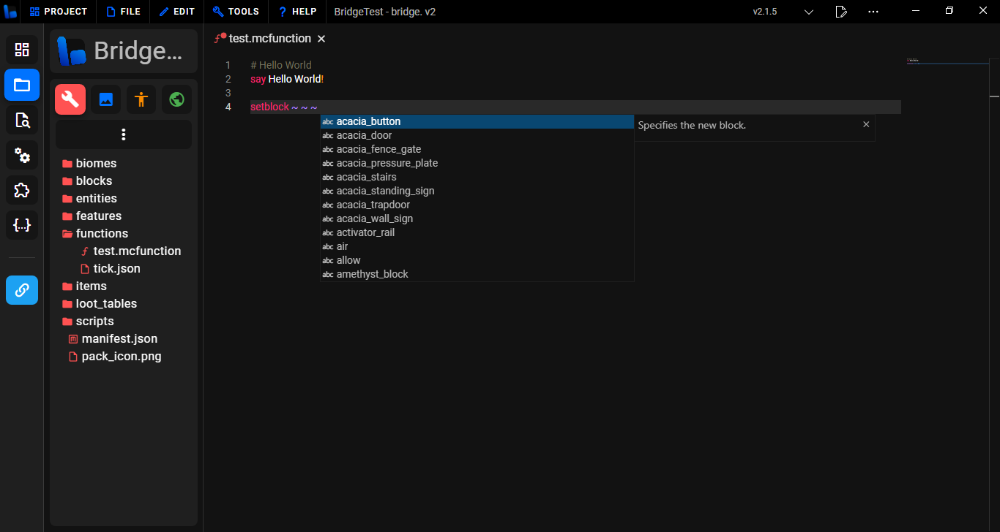

### .js

## Unique editing features

bridge. includes many tools and features that will make your developing experience quicker and easier!

### File previews

File previews are a feature which allow you to view different features inside of bridge., such as previewing entities and seeing their hitbox and rider positions or even particles with hot-reloading so that changes made the particle file are instantly reflected in the preview.

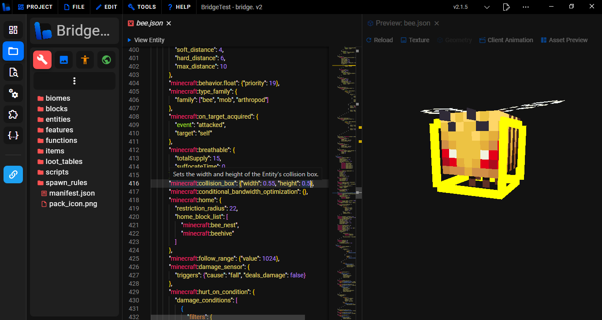

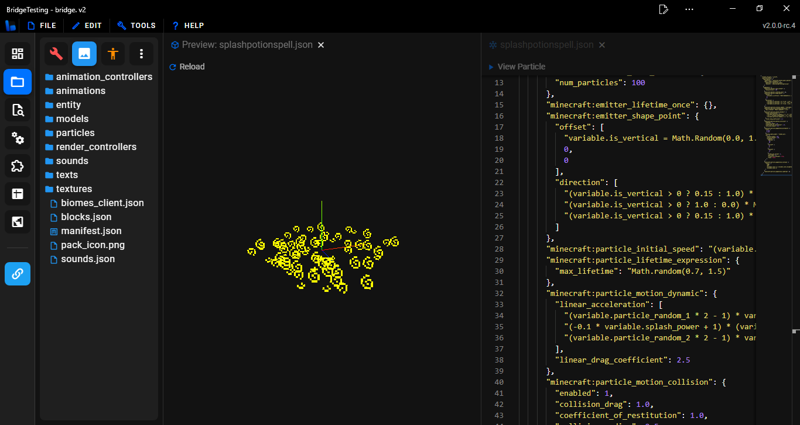

### Go to definition

bridge. includes "Go To Definition" data to allow you quickly jump between files where there is related data.

For example:

Here, the entity behavior file with a matching identifier to the spawn rule has been found.

### Custom Syntax

bridge. has many different custom syntax capabilities. It's specialized compiler makes it easier to add custom syntax into projects. You can even create your own [compiler plugins](/extension-docs/compiler-plugins)!

Built-in custom syntax includes:

-   [Custom components](/extension-docs/custom-components/)
-   [Custom commands](/extension-docs/custom-commands/)
-   [Custom molang](/extension-docs/custom-molang)

With more available on the extension store!

## Customizing bridge.

bridge. features an extension API which allows you to customize UI add new tab types, presets, themes and much more!

You can either [create your own extensions](/extension-docs/) or download extensions made by other creators from the extension store.
This can be found by clicking the **Extensions** button on the sidebar. From here you can download from a collection of extensions to modify and enhance your experience with bridge.

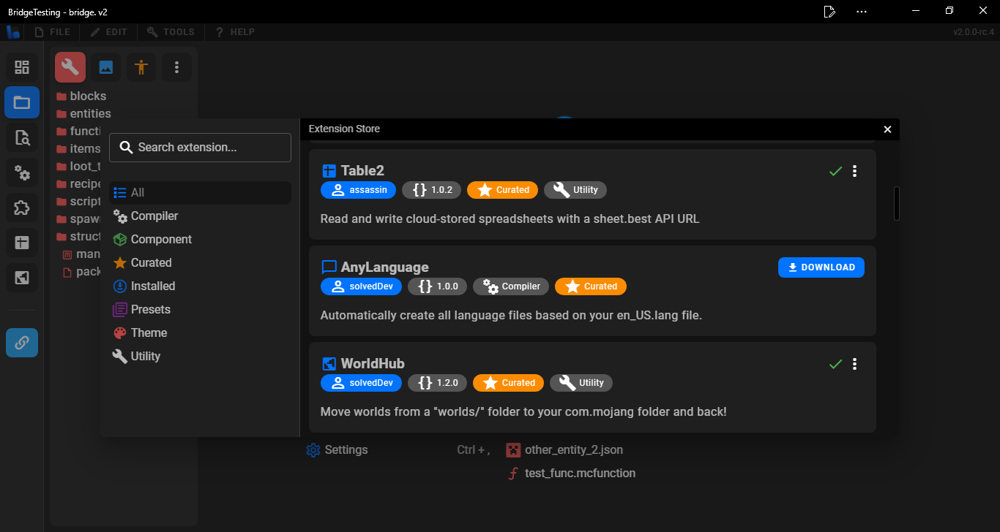

## Need Help?

-   Join the [official bridge. Discord server](https://discord.gg/jj2PmqU)!
-   Check out the [unofficial Minecraft Bedrock documentation](https://bedrock.dev)
-   Learn more about creating addons in the [Unofficial Bedrock Wiki](https://wiki.bedrock.dev)
-   Visit the [official Minecraft Bedrock creator documentation](https://docs.microsoft.com/en-us/minecraft/creator)

More useful links can be found [here](https://wiki.bedrock.dev/knowledge/useful-links.html).
