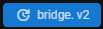

# bridge. v2 Migration

## What's different about bridge. v1 projects and bridge. v2 projects?

bridge. v1 stored its projects in the `development_behavior_packs` and `development_resource_packs` folders within the `com.mojang` directory. However, bridge. v2 approaches this differently by storing your projects in a nicer to work with format and elsewhere on the system, in `Documents` for example, and you are given the option to link your `com.mojang` folder to bridge. v2.

Upon linking this, bridge. v2's compiler will write its `dev` mode output to the `development_behavior_packs`, `development_resource_packs`, `minecraftWorlds` and `development_skin_packs` folders, where these are appropriate for your pack. This means that the source of your projects will always be outside of the `com.mojang` directory which has many benefits, such as not losing all of your projects when uninstalling Minecraft and much easier git integration.

This also means that you should **not** edit your packs in the `com.mojang` folder because they will just be overwritten by bridge.'s compiler output.

## What will happen to my projects once I have transferred them?

The migration process will never delete your original project. During the migration process, your projects will be transferred and custom commands, custom components and custom entity syntax will continue to work as expected. The `bridge` folder in your BP will be removed, bridge. will take the data it needs out of here and remove it from the transferred copy of your project, as it will not be needed anymore.

## Transfer Projects

1. To get started with tranferring your projects to bridge. v2, launch bridge. v1 and make sure you are on `v1.8.0` or higher. You can check this in the bottom right corner. If you are not on this version, make sure to update bridge. via the update prompt at the bottom of the app.

2. After launching bridge. v1, click the update to bridge. v2 notification in the bottom of the app. 

3. This will show a window telling you that bridge. v2 is available and you can update now. To continue, click **`Continue`**.

4. The migration window will then appear. First you need to select a directory to store your bridge. v2 projects. To choose this, click the **`Select Folder`** option and choose a directory. **Ensure you don't choose your `com.mojang` folder.**

5. After you have selected a folder, you need to scroll down and select the projects from the list that you want to transfer, you can also click the **`Select All`** button to select all projects to be transferred. Once the projects are selected, click the **`Confirm`** button.

6. When the loading window closes, you will see some information about what to do next. To proceed to bridge. v2 click **`Go!`**. You can also click **`View Projects`** to open up the directory to where your projects have been transferred to.

## Setup bridge. v2 With Your Transferred Projects

When you have opened bridge. v2, the first step of the setup process will ask you to select a projects folder to store your projects. If you have already migrated your projects over with bridge. v1, you need to select the same directory you chose in **step 4** above.
